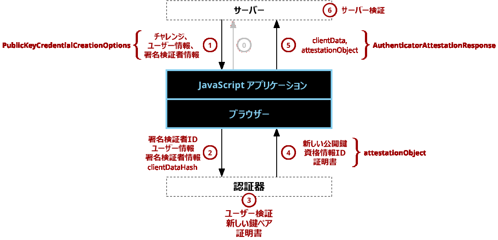
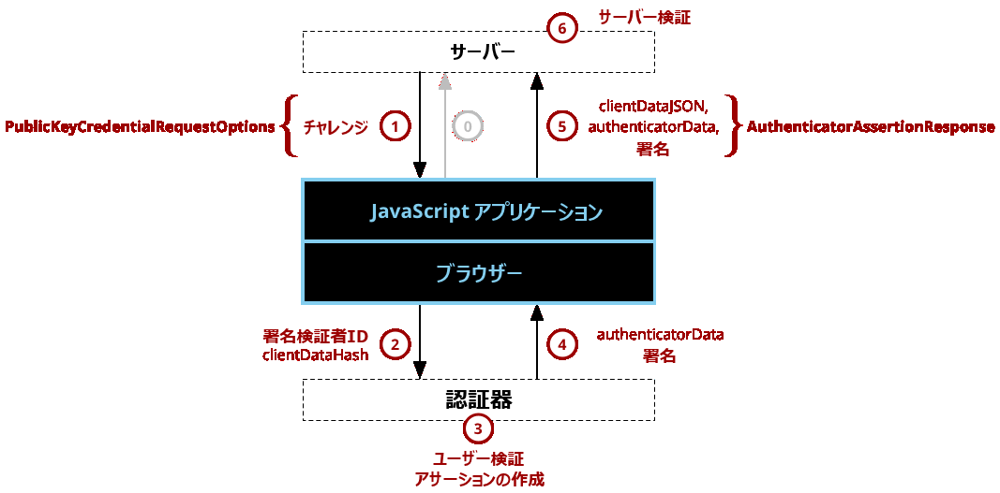

# passkey-go-example

Go での Passkey Autofill を試すための実装

以下の二つのライブラリを利用

- https://github.com/go-webauthn/webauthn (client side)
- https://github.com/MasterKale/SimpleWebAuthn (server side)

## How to run

```bash
go run cmd/server/main.go
```

access to `http://localhost:8080/` and try to register and login.

## Endpoint

### 登録

パスキーの登録時には以下のエンドポイントを利用

- POST: /attestation/options
- POST: /attestation/result



(出典：[ウェブ認証 API – Web API | MDN](https://developer.mozilla.org/ja/docs/Web/API/Web_Authentication_API) )

### 認証

パスキーによる認証時には以下のエンドポイントを利用

- POST: /assertion/options
- POST: /assertion/result



(出典：[ウェブ認証 API – Web API | MDN](https://developer.mozilla.org/ja/docs/Web/API/Web_Authentication_API) )

## Reference

- https://www.w3.org/TR/webauthn-3/
- https://fidoalliance.org/specs/fido-v2.2-rd-20230321/fido-client-to-authenticator-protocol-v2.2-rd-20230321.html
- https://developer.mozilla.org/ja/docs/Web/API/Web_Authentication_API
